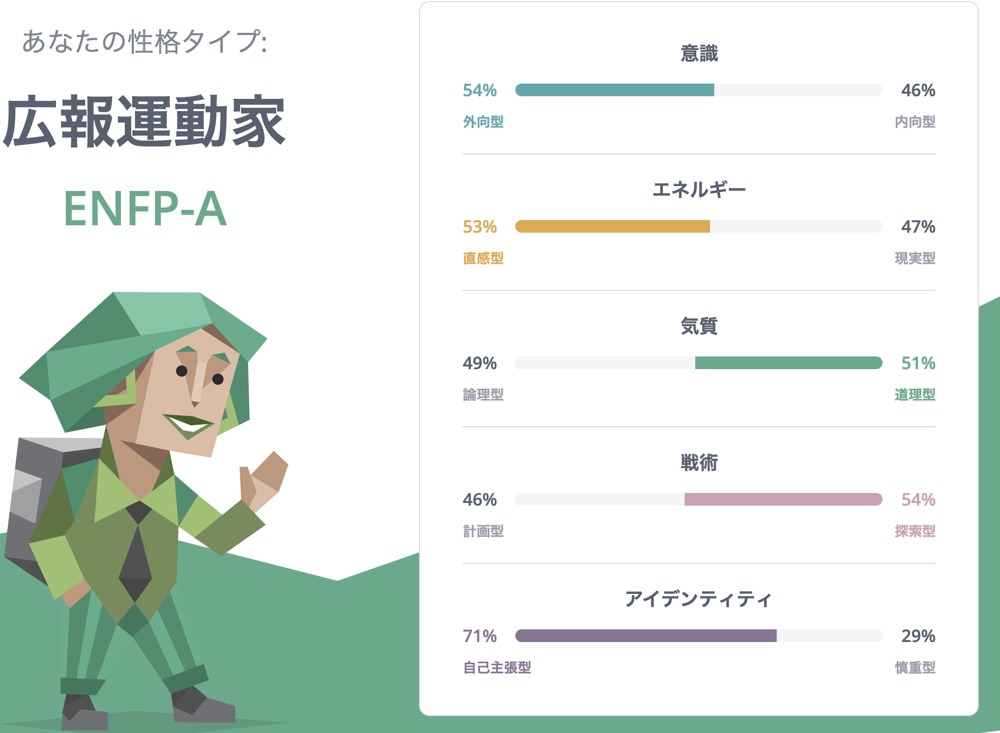

# danimal141's resume

## 目次
<!-- START doctoc generated TOC please keep comment here to allow auto update -->
<!-- DON'T EDIT THIS SECTION, INSTEAD RE-RUN doctoc TO UPDATE -->

- [プロフィール](#%E3%83%97%E3%83%AD%E3%83%95%E3%82%A3%E3%83%BC%E3%83%AB)
- [アカウント](#%E3%82%A2%E3%82%AB%E3%82%A6%E3%83%B3%E3%83%88)
- [職務経歴](#%E8%81%B7%E5%8B%99%E7%B5%8C%E6%AD%B4)
  - [株式会社Speee (2020年9月~)](#%E6%A0%AA%E5%BC%8F%E4%BC%9A%E7%A4%BEspeee-2020%E5%B9%B49%E6%9C%88)
  - [株式会社ニューロープ (2014年2月〜2020年9月）](#%E6%A0%AA%E5%BC%8F%E4%BC%9A%E7%A4%BE%E3%83%8B%E3%83%A5%E3%83%BC%E3%83%AD%E3%83%BC%E3%83%97-2014%E5%B9%B42%E6%9C%88%E3%80%9C2020%E5%B9%B49%E6%9C%88)
    - [■ ファッションデータ分析基盤 (2019年3月〜2020年9月）](#%E2%96%A0-%E3%83%95%E3%82%A1%E3%83%83%E3%82%B7%E3%83%A7%E3%83%B3%E3%83%87%E3%83%BC%E3%82%BF%E5%88%86%E6%9E%90%E5%9F%BA%E7%9B%A4-2019%E5%B9%B43%E6%9C%88%E3%80%9C2020%E5%B9%B49%E6%9C%88)
    - [■ エンジニア組織立ち上げ (2018年頃 ~ 2020年9月）](#%E2%96%A0-%E3%82%A8%E3%83%B3%E3%82%B8%E3%83%8B%E3%82%A2%E7%B5%84%E7%B9%94%E7%AB%8B%E3%81%A1%E4%B8%8A%E3%81%92-2018%E5%B9%B4%E9%A0%83--2020%E5%B9%B49%E6%9C%88)
    - [■ ファッションメディアサービス (2014年2月〜2020年9月）](#%E2%96%A0-%E3%83%95%E3%82%A1%E3%83%83%E3%82%B7%E3%83%A7%E3%83%B3%E3%83%A1%E3%83%87%E3%82%A3%E3%82%A2%E3%82%B5%E3%83%BC%E3%83%93%E3%82%B9-2014%E5%B9%B42%E6%9C%88%E3%80%9C2020%E5%B9%B49%E6%9C%88)
  - [株式会社ポケラボ (2013年9月〜2014年1月）](#%E6%A0%AA%E5%BC%8F%E4%BC%9A%E7%A4%BE%E3%83%9D%E3%82%B1%E3%83%A9%E3%83%9C-2013%E5%B9%B49%E6%9C%88%E3%80%9C2014%E5%B9%B41%E6%9C%88)
  - [株式会社モンスター・ラボ (2012年4月〜2013年8月）](#%E6%A0%AA%E5%BC%8F%E4%BC%9A%E7%A4%BE%E3%83%A2%E3%83%B3%E3%82%B9%E3%82%BF%E3%83%BC%E3%83%BB%E3%83%A9%E3%83%9C-2012%E5%B9%B44%E6%9C%88%E3%80%9C2013%E5%B9%B48%E6%9C%88)
- [私について](#%E7%A7%81%E3%81%AB%E3%81%A4%E3%81%84%E3%81%A6)
  - [技術スタック](#%E6%8A%80%E8%A1%93%E3%82%B9%E3%82%BF%E3%83%83%E3%82%AF)
  - [興味関心](#%E8%88%88%E5%91%B3%E9%96%A2%E5%BF%83)
  - [ストレングスファインダー](#%E3%82%B9%E3%83%88%E3%83%AC%E3%83%B3%E3%82%B0%E3%82%B9%E3%83%95%E3%82%A1%E3%82%A4%E3%83%B3%E3%83%80%E3%83%BC)
  - [16personalities](#16personalities)
  - [資格](#%E8%B3%87%E6%A0%BC)
  - [資料](#%E8%B3%87%E6%96%99)

<!-- END doctoc generated TOC please keep comment here to allow auto update -->

## プロフィール
- ID: `@danimal141`
- 名前： 石井 秀明 (Hideaki Ishii)
- 生年月日： 1986/12/04
- 出身地： 京都府
- 居住地： 東京都
- 最終学歴： 京都工芸繊維大学大学院 生体分子工学専攻 (2012年3月卒業）

## アカウント
- [GitHub](https://github.com/danimal141)
- [Twitter / X](https://twitter.com/danimal141)
- [Zenn](https://zenn.dev/danimal141)
- [note](https://note.com/danimal141)
- [しずかなインターネット](https://sizu.me/danimal141)
- [dev.to](https://dev.to/danimal141)
- [SpeakerDeck](https://speakerdeck.com/danimal141)
- [connpass](https://connpass.com/user/danimal141/)

## 職務経歴
### 株式会社Speee (2020年9月~)
エンジニアリングマネージャーとして、インフラ基盤チームと4つの事業の開発責任者をしています。

現在の主な活動としては、

* インフラ領域の開発 (現状、専任が不在のため、普通に実装をしています）
* 各事業の開発目標設定と課題解決
* エンジニアメンバーの目標設定と成果支援
* エンジニア採用 (採用戦略策定、面談、面接）

あたりになります。とにかく「事業部、事業本部の全エンジニアの開発の総アウトプットが事業のアウトカムに最大限に転換される状態を作り、大きな事業成果を出すこと」に集中しており、そのために必要だと思うことは何でもやります。

それまではリードエンジニアとして新規事業立ち上げに関わり、「急速な事業成長を支えるために開発チームやソフトウェアアーキテクチャをどのように進化させていくか」というテーマとひたすら向き合っていました。今は後任のリードエンジニアにその役割を委譲しつつ、メンバー達を後方支援するような関わり方をしています。

参考： https://tech.speee.jp/entry/why-what-how-engineering

開発だけでなく、総合格闘技のような戦い方で事業や組織に貢献するのが比較的得意だと思っています。振り返ってみても非エンジニアメンバーとエンジニアメンバーの間に入って適切に言葉を翻訳し、事業や組織を前に進めるようなことをよくやっている気がします。

どうぞよろしくお願いいたします。

---

### 株式会社ニューロープ (2014年2月〜2020年9月）
創業メンバー(執行役員）として参画し、自社プロダクト開発を担当しました。

創業から3,4年ほどはCEO、CTO、私の3名体制で少数チームでPMFを目指す形を取っていたため、バックエンド、フロントエンド、インフラ (AWS)、ネイティブ (iOS)の全ての開発に携わってきました。

追加の資金調達が完了した後は事業上、自社AIの開発がもっとも重要になったため、CTOがAI開発、私がWebのプロダクト開発とエンジニア採用・育成に主に責任を持つように分担しました。

プロダクト開発に関しては引き続きCTOにコードレビューに入ってもらいフィードバックを受けながら、なるべく私やチームメンバーのみで技術的な意思決定ができる体制にしていきました。またエンジニア採用に関しては海外エンジニアの採用も検討していたため、開発チームの公用語を英語にしつつ、スカウトの作成、面談設計、採用後のオンボーディング設計、1on1導入なども私主導で行いました。英語学習プロセスに関しては[こちら](https://dangerous-animal141.hatenablog.com/entry/2019/10/06/190000)もご一読いただけると幸いです。

メディア、画像認識API、toB向けSaaS、AIレコメンドエンジンなど、様々な開発に関わってきたのですが、網羅すると長くなり過ぎてしまうため抜粋して記載します。

#### ■ ファッションデータ分析基盤 (2019年3月〜2020年9月）
SNS、メディア上のファッションデータを定期的にクローリングし、自社の画像認識AIに解析させ、その結果を蓄積して分析できるようにしたものです。

データ収集基盤は以下のようなものになります。

1. ターゲットとなるSNSやメディア上のファッションデータをクローリングし、RawデータをAWS上に保存する
2. Rawデータの画像を自社の画像認識APIで認識し、認識結果を別途保存する
3. 上記データに対してETL処理を行い、結果をAWS上で解析できるようにする

1に関してはコマンドラインをGoで実装し、定期的にコマンドを実行するような仕組みにしています。またTwitterのようにAPIが提供されていないメディアも対象だったため、そういったメディア向けのスクレイピングAPIを別途Railsで実装し、それをGoのコマンドライン経由で呼べるようにしました。

3に関してはAWS Glueのクローラを定期的にキックするコマンドラインをKotlinで実装しました。

各社の持つデータアセットが大きな競争優位性になる昨今、データ収集や分析の基盤開発に包括的に携わることができたのは貴重な経験でした。

#### ■ エンジニア組織立ち上げ (2018年頃 ~ 2020年9月）
資金調達後、エンジニア採用・育成の責任者としてエンジニア組織拡大の役割も兼任していました。大戦略として当時からエンジニア採用は激化していたため、

- プロダクト自体もグローバルを視野に入れていたため、エンジニア採用もグローバル市場にリーチする
- 非日本語ネイティブ1人目が決まったタイミングで開発の主要言語も英語に切り替える (私自身、当時ほとんど英語は話せない状態でしたが）

というものを掲げました。

そしてグローバル人材にリーチできるAngelListやJustaというサービスを活用して候補者プールを管理しつつ、英語での採用プロセス設計、実行、改善などをプロダクト開発と並行して行いました。結果、私の在籍期間中に3人の海外エンジニアの採用が決まりました。一人目に採用したメンバーに関してはほぼ未経験という状態から入社し、私の後任テックリードとして活躍するまでに成長してくれました。

#### ■ ファッションメディアサービス (2014年2月〜2020年9月）
メインのWebアプリケーションです。

創業当時、私とCTOの2名体制で開発のすべてを担っていたのですが、私はそれまでフロントエンド以外の実務経験がありませんでした。そのため私はフロントエンドまわりのベースを整えることで信頼貯金を作りながら、それを切り崩してCTOが作っていくバックエンドのコードやインフラの設定をキャッチアップしていくようなスタイルで開発がスタートしました。

そこから半年ほどでバックエンドやインフラ含めてある程度は自走できるようになってきたため、それ以降は2名で優先度順に並んだ開発Issueを上から交互に取っていくようなスクラム開発的なスタイルに落ち着きました。

「画像を定期的にクローリングする機能」「画像にメタデータを付与するSPA管理画面」「商品レコメンド機能」「Payment機能」など、プロダクトに必要な機能開発を一通り担当しました。一部を切り出して派生プロダクトを作ることも多かったので立ち上げ、設計から実装、リリースすべてに責任を持つ機会にも恵まれました。最終的にはピボットしたのですが当初はtoCサービスとして育てていく想定だったため、iOSアプリ開発もその中で2年ほど経験しています。

結果を出せないと会社が潰れるというプレッシャー下での開発経験から、本当に多くのことを学びました。「いくら開発者体験を磨いても、いくらきれいな設計にこだわっても、顧客に使われていないのであれば意味がない」という今の私の価値観もここでの開発が原体験になっていると思います。

---

### 株式会社ポケラボ (2013年9月〜2014年1月）
自社タイトルのチームにフロントエンドエンジニアとして参画しました。既存のガワネイティブ部分のJavaScriptのパフォーマンスチューニングや新規イベント関連の実装を主に担当していました。

---

### 株式会社モンスター・ラボ (2012年4月〜2013年8月）
クライアント先に常駐し、クライアント側で編成された新規事業立ち上げチームのフロントエンドエンジニアとして参画しました。担当はマークアップ全般とフロントエンド (JavaScript / jQuery)開発です。

どちらかというとウォーターフォールに近い開発スタイルだったため、リリースまでに約50ページに渡るページのコーディングをする必要がありました。そのためベトナムのオフショアチーム (フロントエンドエンジニア数名 + ブリッジエンジニア1名）の力を借りて、日本語が話せるブリッジエンジニアの方経由で仕様の認識を皆で揃えつつ、各エンジニアメンバーへの技術的なフィードバックはSkypeで英語でコミュニケーションを取りながら行いました。

当時、私自身も新卒1年目でフロントエンドエンジニアとしてキャリアをスタートしたばかりだったのですが、必死で技術をキャッチアップしつつ、ベースを作って他のメンバーに引き継ぐような、ミニテックリードのような働き方を経験させていただきました。

## 私について
キャリアの大半をスタートアップや新規事業立ち上げのような環境で過ごしているので、0->1開発や総合格闘技的な戦い方で成果を出すのが比較的得意なタイプです。開発を担当するのであればなるべくユーザストーリ単位でフルスタックに責任を持ちたいです。逆に人材が比較的豊富で専門性を強く求められるような環境だとあまりバリューが出せないかもしれません (e.g. バックエンドチームに所属してスペシャリティを発揮するような働き方）。

技術のみを追求するというよりは事業や組織にも興味があるタイプなので、非エンジニアメンバーと議論したり、チームメンバーをサポートしたり、カジュアル面談やミートアップ等で社外のエンジニアの方とお話するのが結構好きだったりします。最高のチームで文化祭前夜のような空気でプロダクト開発がしたいです。

技術スタックとしてはRailsとReact.js(TypeScript)が一番使い慣れていて、次にGoという感じです。必要があれば基本何でも勉強して身につけます。後はブランクはありますが、開発のコンテキストであれば英語環境下でも問題なく働けると思います。

事業や組織のフェーズや直面している課題に応じて「自分が何をすべきか」を考え、一番レバレッジの効く戦い方で成果を出せることが強みだと思います。どうぞよろしくお願いいたします。

### 技術スタック
- Ruby / Ruby on Rails
- TypeScript / JavaScript
- HTML / CSS
- React.js
- GraphQL
- Next.js
- Docker
- Kubernetes
- AWS
- MySQL
- PostgreSQL
- Redis

### 興味関心
成果を出すために必要なことは何でもやりますが、強いて言うなら現場レイヤーよりはマネジメント・経営レイヤーに軸足を置いた事業・組織課題の解決に貢献したいです。開発組織や戦略を作って、成果が出るまで徹底的にオペレーションを磨いたり、生成AIのようなテクノロジーによって組織全体で大幅な開発生産性向上を狙ったり、そういった活動に関心があります。

### ストレングスファインダー

### 16personalities

### 資格
- 基本情報技術者試験 (2015年11月）

### 資料
- [英語で1on1ミーティングができるようになるまでにやったこと](https://dangerous-animal141.hatenablog.com/entry/2019/10/06/190000)
- [事業に向き合い続けたい私は、それでもRailsを使い続ける](https://speakerdeck.com/danimal141/shi-ye-nixiang-kihe-isok-ketaisi-ha-soredemorailswoshi-isok-keru)
- [エンジニアとして事業に貢献するとは「Why-What-Howの一貫性を保ちながら、技術意思決定を積み重ねること」である](https://tech.speee.jp/entry/why-what-how-engineering)
