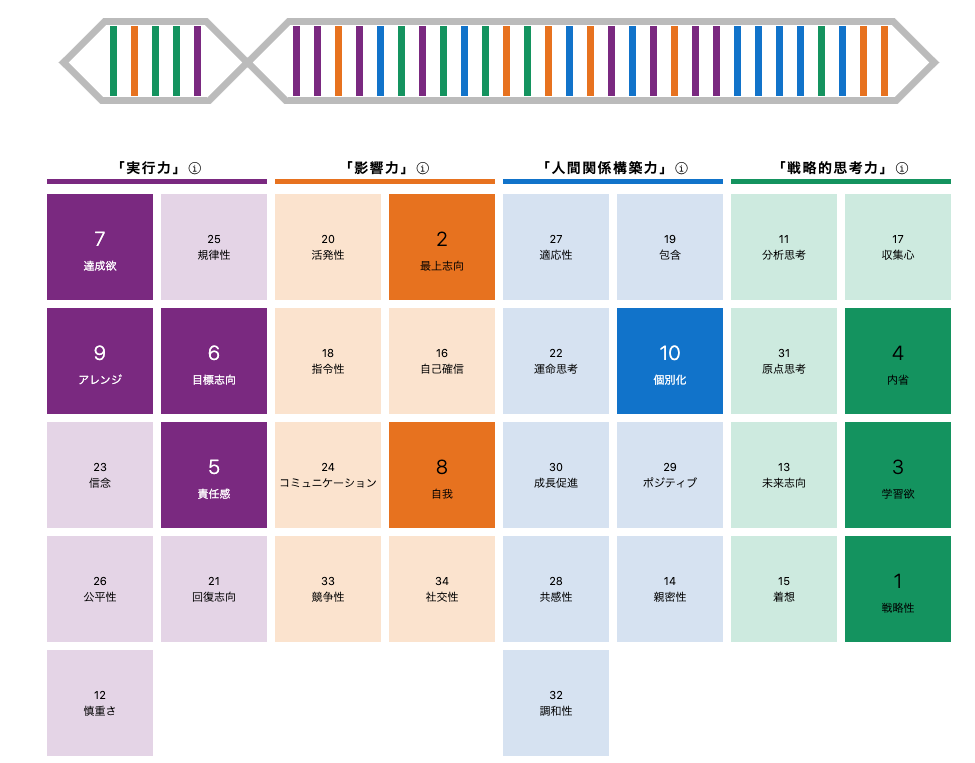

# danimal141's resume

## 目次
<!-- START doctoc generated TOC please keep comment here to allow auto update -->
<!-- DON'T EDIT THIS SECTION, INSTEAD RE-RUN doctoc TO UPDATE -->

- [プロフィール](#%E3%83%97%E3%83%AD%E3%83%95%E3%82%A3%E3%83%BC%E3%83%AB)
- [アカウント](#%E3%82%A2%E3%82%AB%E3%82%A6%E3%83%B3%E3%83%88)
- [職務経歴](#%E8%81%B7%E5%8B%99%E7%B5%8C%E6%AD%B4)
  - [サマリ](#%E3%82%B5%E3%83%9E%E3%83%AA)
  - [株式会社Speee (2020年9月~)](#%E6%A0%AA%E5%BC%8F%E4%BC%9A%E7%A4%BEspeee-2020%E5%B9%B49%E6%9C%88)
    - [事業本部の共通開発基盤の運用・保守 / エンジニアリングマネージャー (2024年4月~)](#%E4%BA%8B%E6%A5%AD%E6%9C%AC%E9%83%A8%E3%81%AE%E5%85%B1%E9%80%9A%E9%96%8B%E7%99%BA%E5%9F%BA%E7%9B%A4%E3%81%AE%E9%81%8B%E7%94%A8%E3%83%BB%E4%BF%9D%E5%AE%88--%E3%82%A8%E3%83%B3%E3%82%B8%E3%83%8B%E3%82%A2%E3%83%AA%E3%83%B3%E3%82%B0%E3%83%9E%E3%83%8D%E3%83%BC%E3%82%B8%E3%83%A3%E3%83%BC-2024%E5%B9%B44%E6%9C%88)
    - [不動産領域の新規プロダクト開発 / リードエンジニア -> エンジニアリングマネージャー (2020年10月~)](#%E4%B8%8D%E5%8B%95%E7%94%A3%E9%A0%98%E5%9F%9F%E3%81%AE%E6%96%B0%E8%A6%8F%E3%83%97%E3%83%AD%E3%83%80%E3%82%AF%E3%83%88%E9%96%8B%E7%99%BA--%E3%83%AA%E3%83%BC%E3%83%89%E3%82%A8%E3%83%B3%E3%82%B8%E3%83%8B%E3%82%A2---%E3%82%A8%E3%83%B3%E3%82%B8%E3%83%8B%E3%82%A2%E3%83%AA%E3%83%B3%E3%82%B0%E3%83%9E%E3%83%8D%E3%83%BC%E3%82%B8%E3%83%A3%E3%83%BC-2020%E5%B9%B410%E6%9C%88)
  - [株式会社ニューロープ (2014年2月〜2020年9月）](#%E6%A0%AA%E5%BC%8F%E4%BC%9A%E7%A4%BE%E3%83%8B%E3%83%A5%E3%83%BC%E3%83%AD%E3%83%BC%E3%83%97-2014%E5%B9%B42%E6%9C%88%E3%80%9C2020%E5%B9%B49%E6%9C%88)
  - [株式会社ポケラボ (2013年9月〜2014年1月）](#%E6%A0%AA%E5%BC%8F%E4%BC%9A%E7%A4%BE%E3%83%9D%E3%82%B1%E3%83%A9%E3%83%9C-2013%E5%B9%B49%E6%9C%88%E3%80%9C2014%E5%B9%B41%E6%9C%88)
  - [株式会社モンスター・ラボ (2012年4月〜2013年8月）](#%E6%A0%AA%E5%BC%8F%E4%BC%9A%E7%A4%BE%E3%83%A2%E3%83%B3%E3%82%B9%E3%82%BF%E3%83%BC%E3%83%BB%E3%83%A9%E3%83%9C-2012%E5%B9%B44%E6%9C%88%E3%80%9C2013%E5%B9%B48%E6%9C%88)
- [私について](#%E7%A7%81%E3%81%AB%E3%81%A4%E3%81%84%E3%81%A6)
  - [技術スタック](#%E6%8A%80%E8%A1%93%E3%82%B9%E3%82%BF%E3%83%83%E3%82%AF)
  - [興味関心](#%E8%88%88%E5%91%B3%E9%96%A2%E5%BF%83)
  - [ストレングスファインダー](#%E3%82%B9%E3%83%88%E3%83%AC%E3%83%B3%E3%82%B0%E3%82%B9%E3%83%95%E3%82%A1%E3%82%A4%E3%83%B3%E3%83%80%E3%83%BC)
  - [16personalities](#16personalities)
  - [資格](#%E8%B3%87%E6%A0%BC)
- [過去アウトプット](#%E9%81%8E%E5%8E%BB%E3%82%A2%E3%82%A6%E3%83%88%E3%83%97%E3%83%83%E3%83%88)

<!-- END doctoc generated TOC please keep comment here to allow auto update -->

## プロフィール
* ID: `@danimal141`
* 生年月日： 1986/12/04
* 出身地： 京都府
* 居住地： 東京都
* 最終学歴： 京都工芸繊維大学大学院 生体分子工学専攻 (2012年3月卒業）

## アカウント
* [GitHub](https://github.com/danimal141)
* [Twitter / X](https://twitter.com/danimal141)
* [Zenn](https://zenn.dev/danimal141)
* [note](https://note.com/danimal141)
* [しずかなインターネット](https://sizu.me/danimal141)
* [dev.to](https://dev.to/danimal141)
* [SpeakerDeck](https://speakerdeck.com/danimal141)
* [connpass](https://connpass.com/user/danimal141/)

## 職務経歴
### サマリ
現在はエンジニアリングマネージャーとして、インフラ基盤チームと4つの事業の開発責任者をしています。

現在の主な活動としては、

* インフラ領域の開発 (現状、専任が不在のため、普通に実装をしています）
* 各事業の開発目標設定と課題解決
* エンジニアメンバーの目標設定と成果支援
* エンジニア採用 (採用戦略策定、面談、面接）

あたりになります。とにかく「事業部、事業本部の全エンジニアの開発の総アウトプットが事業のアウトカムに最大限に転換される状態を作り、大きな事業成果を出すこと」に集中しており、そのために必要だと思うことは何でもやります。

それまではリードエンジニアとして新規事業立ち上げに関わり、「急速な事業成長を支えるために開発チームやソフトウェアアーキテクチャをどのように進化させていくか」というテーマとひたすら向き合っていました。今は後任のリードエンジニアにその役割を委譲しつつ、メンバー達を後方支援するような関わり方をしています。

開発だけでなく、総合格闘技のような戦い方で事業や組織に貢献するのが比較的得意だと思っています。振り返ってみても非エンジニアメンバーとエンジニアメンバーの間に入って適切に言葉を翻訳し、事業や組織を前に進めるようなことをよくやっている気がします。

どうぞよろしくお願いいたします。

---

### 株式会社Speee (2020年9月~)
#### 事業本部の共通開発基盤の運用・保守 / エンジニアリングマネージャー (2024年4月~)
■ 概要

* 所属する事業本部に10以上存在するWebプロダクト群やコラム (WordPress、Kinsta)を安定運用するための基盤 (主にインフラ）があり、前任者から引き継ぐ形で、その基盤全般の運用保守を担当
*  [チーム構成] エンジニア2名 (引き継ぎ前は私含めて2名 -> 私のみ -> 他チームから兼務で1名増員）

■ 期待役割

* 開発基盤グループの責任者として、各プロダクトのスケールや新規プロダクト立ち上げも含め、各プロダクトを安定運用できる基盤を運用し続けること

■  課題

前任者の急な退職により、以下が主な課題でした。

* 私自身が4つの事業の開発責任者を兼務しながら担当しており、その前提でどのように開発基盤を安定運用し続けるか
* 私自身がこれまでアプリケーションエンジニアとしてキャリアを歩んできたため、マネコン上でAWSを触れる程度しかインフラ理解がなく、その前提でどのようにAWS EKSやTerraformで作られた20万行を超える基盤コードをキャッチアップして運用するか
* さらに引き継ぎ期間が2ヶ月しかない状況で、どのように引き継ぐか

■ 成果

結論として、新体制移行後も障害発生数や各所からの依頼対応数は前体制から大きな変化もなく、運用できています。

そこまでに至るプロセスとしては、

* プロダクト自体は基本的にRails / React.js (Next.js)で構成されており、インフラ側もAWS (EKS、ArgoCD、ALB、CloudFront)、Terraformである程度統一されていたため、まずは基本形となる「RailsアプリをArgoCD、EKSで配信すること」をTerraformとyaml (k8s側）でコード管理する前提で、自力で立ち上げることを週末に時間を取ってやりきる (2〜3週間で形にできました）
* 日々、各事業部から開発依頼が飛んでくるので、特に自分がどのように目的を達成するかイメージがつかないものから率先して担当する
  * 引き継ぎ期間は質問できるメンバーがいたので、観点を教えてもらい、やったことは社内ドキュメントツールにすべて記事として残す
* 事業側の開発責任を果たす部分はメンバーと事業責任者にも協力してもらう形で一時的に自分の関与度を下げてバランスを取る
* チームが私一人になることが確定していたので、社内スカウティングをし、兼務でもよいので異動者を最低一人は見立てる
  * そのメンバーもアプリケーションエンジニアであることは確定していたので、私自身がそのメンバーにティーチング可能な水準を前提に知識獲得を進める
  * そのために、それまでよりも毎朝1時間早く起きるようにし、出社前に必ずインフラのコードリーディングを行って不明点を少しでも潰すような習慣を2ヶ月続ける

を同時並行に走らせることで実現しました。

個人的にもこれまで若干の苦手意識のあったインフラ領域も一定の自信を持って進められるようになり、自己成長を感じられた経験となりました。

#### 不動産領域の新規プロダクト開発 / リードエンジニア -> エンジニアリングマネージャー (2020年10月~)
■ 概要

* 新規事業立ち上げメンバーとして、不動産領域の新規プロダクト開発を担当
* スクラム、アジャイルに近い開発スタイル
* [プロダクトチーム構成] エンジニア3-5名、PM、事業責任者

■ 期待役割

新規事業の開発責任者として、

* 技術選定、設計、実装、リリース
* PMメンバーと協力し、プロダクト開発計画の策定、振り返り
* エンジニア採用
* エンジニアメンバーのピープルマネジメント

などを担当しました。

■ 成果

とにかく「事業を早く成立させること」が最重要事項だと捉え、

* 事業に必要なコア価値の開発になるべくリソースを集中させること
  * コアじゃないことであまり悩みたくない、ノンコアな機能開発はなるべく楽をすること
* リッチなフロントエンド開発に耐えられるような構成にすること

を重視して技術選定、プロダクト開発を進めました。

具体的には

* 認証・認可などプロダクトにおいて必要だがコア価値ではない機能はAuth0を採用して、極力開発に時間を割かないようにする
  * サービスのスケールを想定すると、一定ユーザ数を超えるとコストが大幅に上がることは想定したうえで、そこまではあえてAuth0を使うという意思決定
* 良い意味で枯れているRuby on Railsを採用し、徹底的にレールに乗ることでコア価値の開発に集中できるようにする
  * 「俺が考える最高のアーキテクチャ」のようなものを極力考えないようにした
  * これまでRailsをメインで採用してきた開発組織だったというのも大いにあります (組織の資産を有効活用するため）
* サービス特性的にリッチなユーザ体験を作ることが想定されていたので、フロントエンドはRailsではなく、React / TypeScriptに寄せる

といった構成にし、将来の開発速度を落とさないために、

* 仮説検証段階ではなるべく捨てやすい構成で、テーブルやモデルを作り、一定の検証期間を経て筋が悪いと判断した機能に関連する実装はどんどん捨てていく
* 自分の関わり方はMVPといえるような骨子ができるまでは自分が誰よりもコードを書いて主導する。そこから徐々にチーム内での開発量は半分程度に抑え、エンジニア採用 (週2〜3程度の面談、面接や新卒エンジニアインターンの企画、実行）も並行して進めるようにし、将来のリード候補採用や新卒エンジニアを採用、育成することにリソース配分をシフトする

といった形で常に短期と中長期の視点を持ち、事業成果という本質を見失わない動き方を意識していました。

その結果、一度事業モデルの見直しに伴うピボットなども挟んだのですが、立ち上げから3-4ヶ月でベータ版リリース、約1年で本リリース、という速度感で進行できました。

現在は別メンバーにプロダクトリードを移譲しているのですが、私はエンジニアリングマネージャーとしてエンジニアメンバーの成果支援という形で該当プロダクト、事業に携わっています。

■ 参考資料

* https://tech.speee.jp/entry/2021/10/25/142838
* https://tech.speee.jp/entry/why-what-how-engineering

---

### 株式会社ニューロープ (2014年2月〜2020年9月）
スタートアップに創業メンバー (ソフトウェアエンジニア、執行役員）、1人目社員として参画し、主にファッション領域の課題解決のための自社プロダクト開発を担当しました。

創業から3、4年ほどはCEO、CTO、私の3名体制で少数チームでPMFを目指す形を取っていたため、バックエンド、フロントエンド、インフラ (AWS)、ネイティブ (iOS)の全ての開発に携わってきました。何度かピボットを重ね、事業上自社AI (画像認識AI)の開発がもっとも重要となったタイミングから、CTOが自社AI開発、私がWebのプロダクト開発とエンジニア採用・育成に主に責任を持つように分担しました。

また、エンジニア採用に関しては海外エンジニアを採用するという意思決定をし、公用語の英語化、スカウトの作成、面談設計、採用後のオンボーディング設計、1on1導入などを私主導で行いました。英語学習プロセスに関しては

https://dangerous-animal141.hatenablog.com/entry/2019/10/06/190000

もご一読いただけると幸いです。

結果を出せないと会社が潰れるというプレッシャー下での開発経験から、本当に多くのことを学ばせていただきました。「いくら開発者体験を磨いても、いくらきれいな設計にこだわっても、顧客に使われていないのであれば意味がない」という今の私の価値観もここでの開発が原体験になっていると思います。

---

### 株式会社ポケラボ (2013年9月〜2014年1月）
自社タイトルのチームにフロントエンドエンジニアとして参画しました。既存のガワネイティブ部分のJavaScriptのパフォーマンスチューニングや新規イベント関連の実装を主に担当しました。

---

### 株式会社モンスター・ラボ (2012年4月〜2013年8月）
クライアント先に常駐する形で、クライアント側で編成された新規事業立ち上げチームのフロントエンドエンジニアとして参画しました。担当はマークアップ全般とフロントエンド (JavaScript / jQuery)開発です。

どちらかというとウォーターフォールに近い開発スタイルで、リリースまでに約50ページに渡るページのコーディングをする必要がありました。そのためベトナムのオフショアチーム (フロントエンドエンジニア数名 + ブリッジエンジニア1名）の力を借りて、日本語が話せるブリッジエンジニアの方経由で仕様の認識を皆で揃えつつ、各エンジニアメンバーへの技術的なフィードバックはSkypeで英語でコミュニケーションを取りながら行いました。

その結果、何とか計画通りのサービスリリースを実現でき、常駐先の方々に感謝を伝えていただきました。

## 私について
キャリアの大半をスタートアップや新規事業立ち上げのような環境で過ごしているので、0->1開発や総合格闘技的な戦い方で成果を出すのが比較的得意なタイプです。開発を担当するのであればなるべくユーザストーリ単位でフルスタックに責任を持ちたいです。逆に人材が比較的豊富で専門性を強く求められるような環境だとあまりバリューが出せないかもしれません (e.g. バックエンドチームに所属してスペシャリティを発揮するような働き方）。

技術のみを追求するというよりは事業や組織にも興味があるタイプなので、非エンジニアメンバーと議論したり、チームメンバーをサポートしたり、カジュアル面談やミートアップ等で社外のエンジニアの方とお話するのが結構好きだったりします。最高のチームで文化祭前夜のような空気でプロダクト開発がしたいです。

技術スタックとしてはRailsとReact.js(TypeScript)が一番使い慣れていて、次にGoという感じです。必要があれば基本何でも勉強して身につけます。後はブランクはありますが、開発のコンテキストであれば英語環境下でも問題なく働けると思います。

事業や組織のフェーズや直面している課題に応じて「自分が何をすべきか」を考え、一番レバレッジの効く戦い方で成果を出せることが強みだと思います。どうぞよろしくお願いいたします。

### 技術スタック
* Ruby / Ruby on Rails
* TypeScript / JavaScript
* HTML / CSS
* React.js
* GraphQL
* Next.js
* Docker
* Kubernetes
* AWS
* MySQL
* PostgreSQL
* Redis

### 興味関心
成果を出すために必要なことは何でもやりますが、強いて言うなら現場レイヤーよりはマネジメント・経営レイヤーに軸足を置いた事業・組織課題の解決に貢献したいです。開発組織や戦略を作って、成果が出るまで徹底的にオペレーションを磨いたり、生成AIのようなテクノロジーによって組織全体で大幅な開発生産性向上を狙ったり、そういった活動に関心があります。

### ストレングスファインダー

### 16personalities

### 資格
* 基本情報技術者試験 (2015年11月）

## 過去アウトプット
* [留学経験のないエンジニアが英語で1on1できるようになるまでにやったこと](https://note.com/danimal141/n/n454308e5cda0)
* [「事業に向き合い続けたい私は、それでもRailsを使い続ける」というタイトルでKaigi on Rails 2021に登壇しました](https://tech.speee.jp/entry/2021/10/25/142838)
* [エンジニアとして事業に貢献するとは「Why-What-Howの一貫性を保ちながら、技術意思決定を積み重ねること」である](https://tech.speee.jp/entry/why-what-how-engineering)
* [エンジニアリングマネージャーガイドライン](https://note.com/danimal141/n/n7e5fd7d1f1d7)
* [事業と技術のバイリンガル集団を目指して * DX事業本部が描くエンジニアの事業貢献モデル -](https://tech.speee.jp/entry/biz-tech-bilinguals)
* [常に目的を見失わずにいたい。EMとして開発文化を作るために取り組んでいること](https://tech.speee.jp/entry/build-dev-culture)
