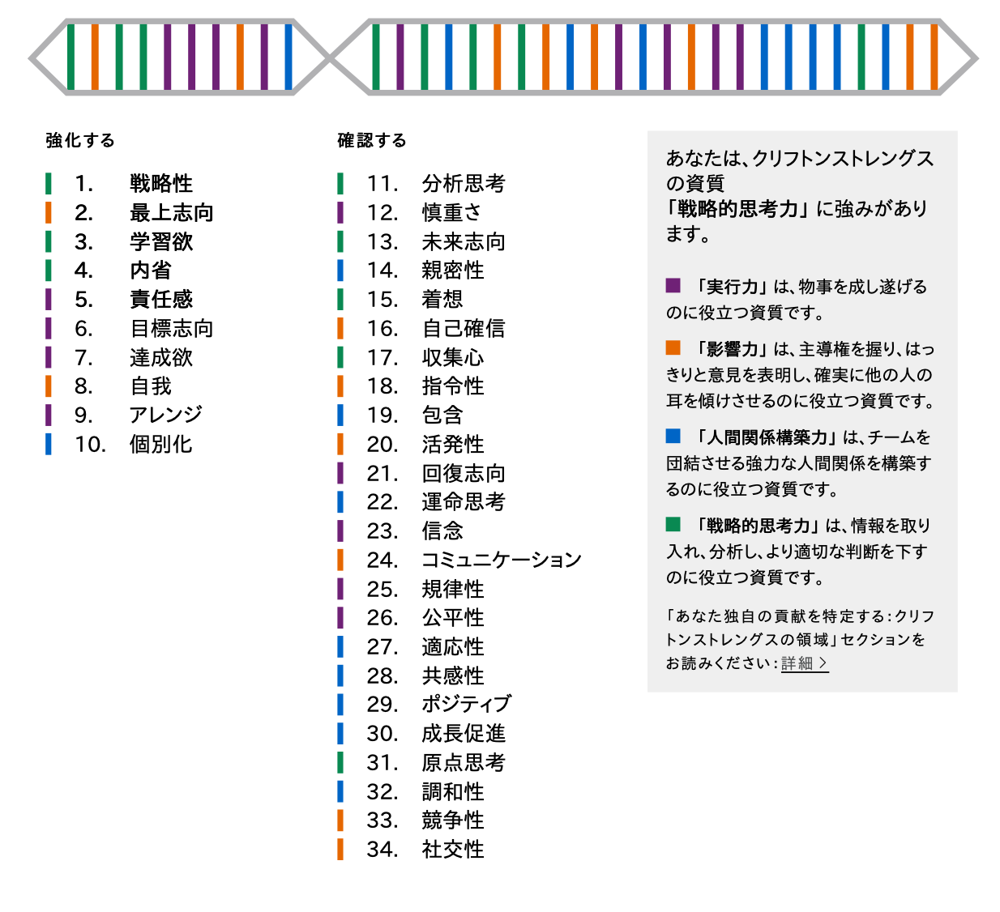
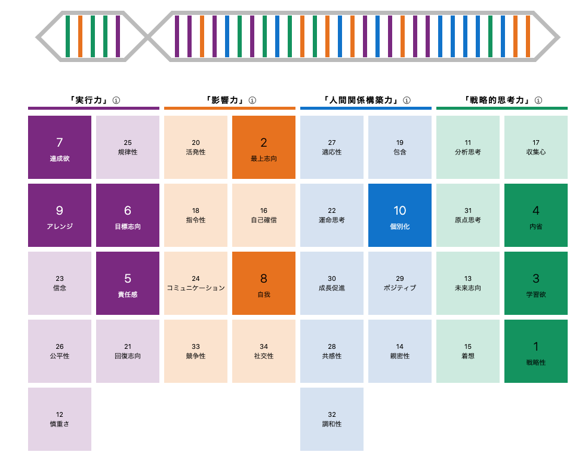
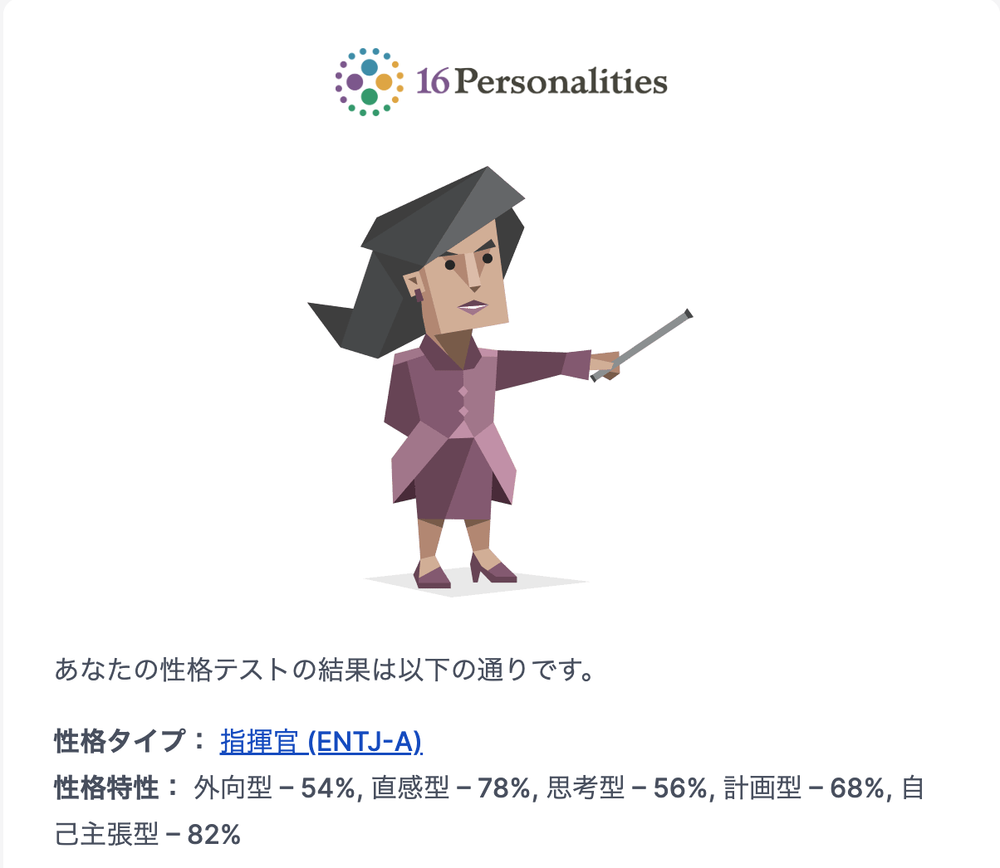
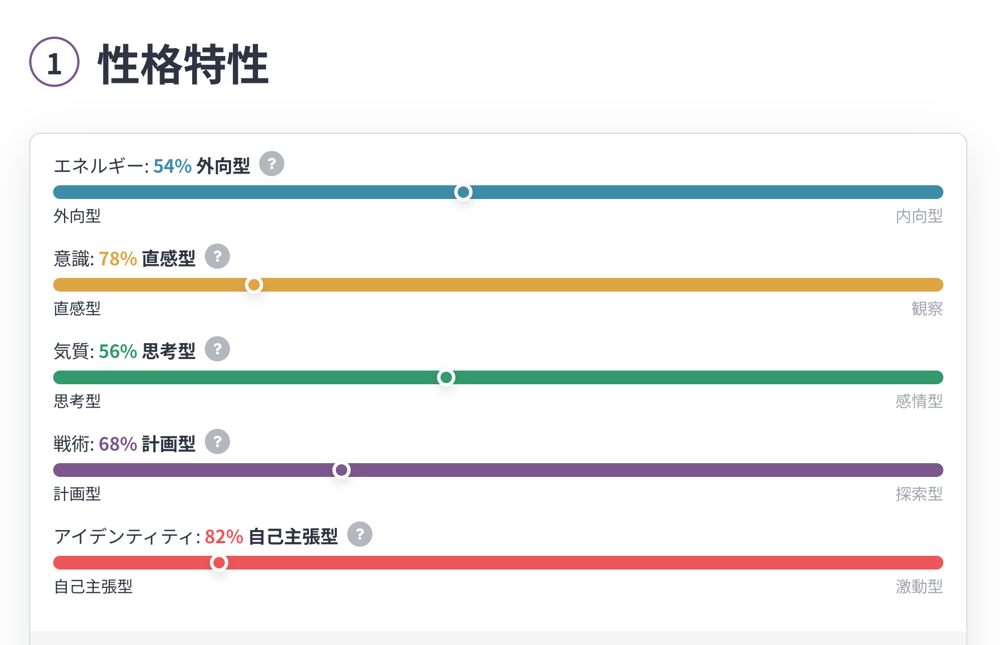

# danimal141's resume

## プロフィール
* ID: `@danimal141`
* 生年月日： 1986/12/04
* 出身地： 京都府
* 居住地： 東京都
* 最終学歴： 京都工芸繊維大学大学院 生体分子工学専攻 (2012年3月卒業）

## アカウント
* [GitHub](https://github.com/danimal141)
* [Twitter / X](https://twitter.com/danimal141)
* [Zenn](https://zenn.dev/danimal141)
* [note](https://note.com/danimal141)
* [しずかなインターネット](https://sizu.me/danimal141)
* [SpeakerDeck](https://speakerdeck.com/danimal141)
* [connpass](https://connpass.com/user/danimal141/)

## 職務経歴
### サマリ
現在はエンジニアリングマネージャーとして、開発基盤チーム (SRE + Platform Engineering)と4つの事業の開発責任者をしています。

現在の主な活動としては、以下になります。

* インフラ領域の開発 (普通に実装もしています）
* 各事業の開発目標設定と課題解決
* エンジニアメンバーの目標設定と成果支援
* エンジニア採用 (採用戦略策定、面談、面接）

になります。とにかく「事業部、事業本部の全エンジニアの開発の総アウトプットが事業のアウトカムへ最大限転換される状態を作ること。その結果、大きな事業成果を出すこと」が自身の責任だと思っており、そのために必要なことは何でもやります。

それまではリードエンジニアとして新規事業立ち上げに関わり、「急速な事業成長を支えるために開発チームやソフトウェアアーキテクチャをどのように進化させていくか」というテーマとひたすら向き合っていました。今は後任のリードエンジニアにその役割を委譲しつつ、メンバー達を後方支援するような関わり方をしています。

開発だけでなく、総合格闘技のような戦い方で事業や組織に貢献するのが比較的得意だと思っています。振り返ってみても非エンジニアメンバーとエンジニアメンバーの間に入って適切に翻訳し、事業や組織を前に進めるような仕事をよくやっている気がします。

どうぞよろしくお願いいたします。

---

### 株式会社Speee (2020年9月~)
#### 事業本部の共通開発基盤の開発 / EM・TechPM (2024年4月~)
##### 概要
* 所属する事業本部に10以上存在するWebプロダクト群やコラム (WordPress、Kinsta)を安定運用するための基盤 (主にインフラ）があり、前任者から引き継ぐ形で、その基盤全般の運用保守を担当
* [チーム構成］エンジニア3名 (引き継ぎ前は私含めて2名 -> 私のみ -> 他チームから兼務で2名増員）

##### 期待役割
* 開発基盤グループの責任者として、各プロダクトのスケールや新規プロダクト立ち上げも含め、各プロダクトを安定運用できる基盤を運用し続けること

##### 課題
前任者の急な退職により、以下が主な課題でした。

* 当時、マネコン上でAWSを触れる程度のインフラ経験しかなかった私が、AWS EKSやTerraformで作られた20万行を超える基盤のコードをキャッチアップして運用できるようにすること
* それを引き継ぎ期間が2ヶ月しかない状況で、私自身が4つの事業の開発責任者を兼務しながら実現すること

##### 成果
結果として、これまでと同水準のQCDを実現できる新体制を構築し、新たな開発投資やコストカット施策も進められています。

そこに至るプロセスとしては、以下になります。

* 事業側の開発責任を果たす部分はメンバーと事業責任者にも協力してもらう形で一時的に自分の関与度を下げ、実装時間を確保する
* まずは基本形となる「RailsアプリをArgoCD、EKSから配信すること」をTerraformとYAML (k8s側）でコード管理する前提として、自力で立ち上げることを週末に時間を取ってやりきる (2〜3週間で形にできました）
  * プロダクト自体は基本的にRails / React.js (Next.js)で構成されており、インフラ側もAWS (EKS、ArgoCD、ALB、CloudFrontなど）、Terraformである程度統一されていた
* 日々、各事業部から開発依頼が飛んでくるので、特に自分がどのように目的を達成するかイメージがつかないものから率先して担当する
  * 引き継ぎ期間は質問できるメンバーがいたので、重視すべき観点やコードからは読み取れない前提情報中心に教えてもらい、担当した作業はすべてドキュメントに残し、見返せるようにする (今後入ってもらうメンバーのオンボーディングも考慮して）
* メンバーが私一人になることが確定していたので、社内スカウティングをし、兼務でもよいので異動者を2人見立てる
  * そのメンバー候補もインフラ未経験であることは確定していたので、私自身がそのメンバーにティーチング可能な水準を前提に知識獲得を進める
  * そのために、それまでよりも毎朝1時間早起きし、出社前に必ずインフラのコードリーディングを行って理解を深める習慣を2ヶ月続ける

また、これまでは開発基盤専任のメンバー中心でチームを構成していたため、「各事業の投資状況がわからない (情報不足、事業理解不足による）ため、成果定義・目標がなかなか決められない」という問題がありました。

それに対し、私は事業部のEMも兼務しており、各事業の状況を理解しているため、開発基盤として「どの時間軸で何に投資すべきか」を判断する勘所が歴代の基盤メンバーより圧倒的に働きます。そういった背景から現在は開発基盤チームのTechPMのような機能も兼ねて、事業状況に応じて横断的な開発投資計画の策定と実行を自身で進められるようになりました。

#### 不動産領域の複数プロダクト開発 / リードエンジニア・EM (2020年10月~)
##### 概要
* 新規事業立ち上げメンバーとして、不動産領域の新規プロダクト開発を担当
  * スクラム、アジャイルに近い開発スタイル
  * プロダクトチーム構成： エンジニア3-5名、PM、事業責任者
* そこからEMになり、別新規事業立ち上げ、既存事業のEMを兼務

##### 期待役割
新規事業の開発責任者〜EMとして、以下を担当しました。

* 技術選定、設計、実装、リリース
* PMメンバーと協力し、プロダクト開発計画の策定、オペレーション (課題定義、アクション、振り返り）
* エンジニア採用
* エンジニアメンバーの成果定義、成果支援、評価

##### 成果
新規事業立ち上げにおいては、とにかく「事業を早く成立させ、グロースフェーズに乗せること」が最重要事項だと捉え、以下を重視しました。

* 事業に必要なコア価値の開発になるべくリソースを集中させること
  * コアじゃないことであまり悩みたくない、ノンコアな機能開発はなるべく楽をすること
  * コアとなるデータの取りこぼしがないような設計を実現すること
* リッチなフロントエンド開発へ対応できるような構成にすること

具体的には、以下のような意思決定を心がけてきました。

* 認証・認可などプロダクトにおいて必要だがコア価値ではない機能はAuth0を採用して、極力開発に時間を割かないようにする
  * サービスのスケールを想定すると、一定ユーザ数を超えるとコストが大幅に上がることは想定したうえで、そこまではあえてAuth0を使うという意思決定
* 良い意味で枯れているRuby on Railsを採用し、徹底的にレールを活用することでコア価値の開発へ集中できるようにする
  * 「俺が考える最高のアーキテクチャ」のようなものを極力、導入しないようにした
  * これまでRailsをメインで採用してきた開発組織だったという背景もあります (組織の資産を有効活用するため）
* サービス特性的にリッチなユーザ体験を作ることが想定されていたので、フロントエンドはRailsではなく、React / TypeScriptに寄せる

また将来の開発速度を落とさないために、以下の形で常に短期と中長期の視点を持ちました。

* 仮説検証段階ではなるべく捨てやすい構成で、テーブルやモデルを作り、一定の検証期間を経て筋が悪いと判断した機能に関連する実装はどんどん捨てていく
* 自分の関わり方はMVPといえるような骨子ができるまでは自分が誰よりもコードを書いて主導する。そこから徐々にチーム内での開発量は半分程度に抑え、エンジニア採用 (週2〜3程度の面談、面接や新卒エンジニアインターンの企画、実行）も並行して進めるようにし、将来のリード候補や新卒エンジニアを採用、育成することにリソース配分をシフトする

その結果、一度事業モデルの見直しに伴うピボットなども挟んだのですが、立ち上げから3ヶ月でベータ版リリースという速度感で事業の検証を進行できました。

現在は各事業、後任のリードエンジニアにプロダクトリードを移譲し、私はEMとしてエンジニアメンバーの成果支援や各チームの開発生産性向上支援という形で各事業に携わっています。

##### 参考資料

* https://tech.speee.jp/entry/2021/10/25/142838
* https://tech.speee.jp/entry/why-what-how-engineering

---

### 株式会社ニューロープ (2014年2月〜2020年9月）
スタートアップに創業メンバー (ソフトウェアエンジニア、執行役員）、1人目社員として参画し、主にファッション領域の課題解決のための自社プロダクト開発を担当しました。

創業から3、4年ほどはCEO、CTO、私の3名による少数チームでPMFを目指す形を取っていたため、バックエンド、フロントエンド、インフラ (AWS)、iOSアプリの全ての開発に携わってきました。
何度かピボットを重ね、自社AI (ファッション画像認識AI)の開発が事業上、最重要だと判断したタイミングから、CTOが自社AIの開発、私がプロダクト開発とエンジニア採用・組織づくり全般に責任を持つように役割分担しました。

また、エンジニア採用に関しては海外エンジニアを採用するという意思決定をし、公用語の英語化から、母集団形成、スカウト、面接と見極め、採用後のオンボーディング設計、1on1の導入などを私主導で行いました。

英語学習プロセスに関しては、以下をご一読いただけると幸いです。

* [留学経験のないエンジニアが英語で1on1できるようになるまでにやったこと](https://note.com/danimal141/n/n454308e5cda0)

明確なタイムリミットがあり、結果を出せないと会社が潰れるというプレッシャー下での開発経験から、本当に多くのことを学ばせていただきました。「いくら開発者体験を磨いても、いくらきれいなソフトウェア設計にこだわっても、顧客に使われないのであれば意味がない」という今の私の価値観はこの環境から醸成されました。

---

### 株式会社ポケラボ (2013年9月〜2014年1月）
自社タイトルのチームにフロントエンドエンジニアとして参画しました。既存のガワネイティブ部分のJavaScriptのパフォーマンスチューニングや新規イベント関連の実装を主に担当しました。

---

### 株式会社モンスター・ラボ (2012年4月〜2013年8月）
クライアント先に常駐する形で、クライアント側で編成された新規プロダクトチームのフロントエンドエンジニアとして参画しました。担当はマークアップ全般とフロントエンド (JavaScript / jQuery)開発です。当時、ちょうど各社がスマホシフトを進めている時期で、このプロダクトはWebメインでしたが、レスポンシブデザインで良質なユーザ体験を作ることが重要でした。

どちらかというとウォーターフォールに近い開発スタイルで、リリースまでに約50ページに渡るページのコーディングをする必要がありました。そのためベトナムのオフショアチーム (フロントエンドエンジニア数名 + ブリッジエンジニア1名）の力を借りました。

日本語が話せるブリッジエンジニアの方経由で仕様の認識を皆で揃えつつ、各エンジニアメンバーへの技術的なフィードバックはSkypeで英語コミュニケーションを取りながら行いました。当時、私は新卒1年目だったため、能力も低く、投下できるリソースは稼働時間しかなかったため、「チームの誰よりも遅く残り、誰よりも早く出社する」ということだけは徹底していたのをよく覚えています。

その結果、何とか計画通りのサービスリリースを実現でき、常駐先のクライアントから「ここまで期日やクオリティを妥協なく一緒にこだわってくれるパートナーの方は初めてだ」と感謝を伝えていただきました。

## 私について
キャリアの大半をスタートアップや新規事業立ち上げのような環境で過ごしているので、0->1開発や総合格闘技的な戦い方で成果を出すのが比較的得意なタイプです。機能開発を担当する際はなるべくユーザストーリー単位でフルスタック、フルサイクルに責任を持ちたいです。逆に人材が比較的豊富で専門性を強く求められるような環境だとあまりバリューが出せないかもしれません (e.g. バックエンドチームに所属してスペシャリティを発揮するような働き方）。

技術のみを追求するというよりは事業や組織にも興味があるタイプなので、非エンジニアメンバーと議論したり、チームメンバーをサポートしたり、カジュアル面談やミートアップ等で社外の方とお話するのも結構好きだったりします。最高のチームで文化祭前夜のような空気感でプロダクト開発、事業開発がしたいです。

技術スタックとしてはRailsとReact.js(TypeScript)が一番使い慣れていて、次にGoという感じです。最近だとTerraformを一番書いていますが。必要あれば基本何でも勉強して身につけますし、商談に同席したり、P/Lを読んだりもします。また、ブランクがありますが、開発のコンテキストであれば英語環境下でも問題なく働けます。

事業や組織のフェーズや直面している課題に応じて「自分が何をすべきか」を常に考え、一番レバレッジの効く戦い方で成果を出せることが強みだと思います。どうぞよろしくお願いいたします。

### スキル
* Ruby / Ruby on Rails
* TypeScript / JavaScript
* React.js / Next.js
* Terraform
* Kubernetes
* AWS / GCP (BigQuery) / Azure (Entra ID)
* MySQL / PostgreSQL / Redis
* エンジニア採用
* ピープルマネジメント全般

### 興味関心
成果を出すために必要なことは何でもやりますが、強いて言うなら現場レイヤーよりはマネジメント・経営レイヤーに軸足を置いた事業・組織課題の解決に貢献したいです。開発組織や戦略を作って、成果が出るまで徹底的にオペレーションを磨いたり、生成AIのようなテクノロジーによって組織全体で大幅な開発生産性向上を狙ったり、そういった活動に最近は関心があります。

### ストレングスファインダー

### 16personalities

### 資格
* 基本情報技術者試験 (2015年11月）

## アウトプット
### 所属組織テックブログ
* [AI時代の市場価値を高める: 「二つの解像度」を磨くSpeee DXエンジニアの成長環境](https://tech.speee.jp/entry/ai-era-dx-engineers)
* [事業と技術のバイリンガル集団を目指して - DX事業本部が描くエンジニアの事業貢献モデル -](https://tech.speee.jp/entry/biz-tech-bilinguals)
* [「良いコードレビューとは」というタイトルで「コードレビューどうしてる？ 品質向上と効率化の現場Tips共有会」に登壇しました！](https://tech.speee.jp/entry/code-review-event)
* [常に目的を見失わずにいたい。EMとして開発文化を作るために取り組んでいること](https://tech.speee.jp/entry/build-dev-culture)
* [エンジニアとして事業に貢献するとは「Why-What-Howの一貫性を保ちながら、技術意思決定を積み重ねること」である](https://tech.speee.jp/entry/why-what-how-engineering)
* [「事業に向き合い続けたい私は、それでもRailsを使い続ける」というタイトルでKaigi on Rails 2021に登壇しました](https://tech.speee.jp/entry/2021/10/25/142838)

### 個人アウトプット
* [エンジニアリングマネージャーガイドライン](https://note.com/danimal141/n/n7e5fd7d1f1d7)
* [留学経験のないエンジニアが英語で1on1できるようになるまでにやったこと](https://note.com/danimal141/n/n454308e5cda0)
* [キャリアは具体と抽象の螺旋階段を登ることで築かれるのではという話](https://note.com/danimal141/n/na14d687bcdd9)
* [良いコードレビューとは](https://zenn.dev/danimal141/articles/a907e3d35561a0)
